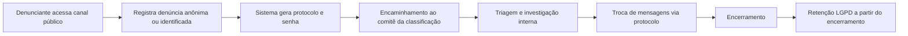

# Canal de Denúncias — Evidências para o Ministério do Trabalho

**Documento:** Evidências de funcionamento, anonimato, auditoria e proteção de dados  
**Versão:** 1.0  
**Data:** ______________________  

| Campo | Preenchimento |
|-------|----------------|
| Empresa | |
| CNPJ | |
| Unidade / estabelecimento | |
| Responsável Compliance / RH | |
| Responsável DPO / TI | |
| URL canal público | ex.: `https://www.empresa.com.br/canaldenuncia/` |

---

## 1. Objetivo deste documento

Demonstrar à fiscalização e à auditoria interna/externa que a organização dispõe de **canal de denúncias operacional**, com:

- acesso público sem identificação obrigatória;
- proteção técnica da confidencialidade (criptografia e controle de acesso);
- rastreabilidade de ações internas (auditoria);
- política de retenção e exclusão alinhada à LGPD;
- governança por comitês com segregação de funções.

Este material deve ser complementado por **prints de tela** (Anexo A) e, opcionalmente, **evidências técnicas de banco** sanitizadas (Anexo B).

---

## 2. Base normativa e institucional

### 2.1 Referências legais e regulatórias

| Norma | Relevância |
|-------|------------|
| **NR-1** (Gerenciamento de Riscos Ocupacionais) | Exige canal para relatos e mecanismos de gestão |
| **Lei 14.457/2022** | Prevenção e combate ao assédio — reforço da necessidade de canal seguro |
| **Lei 13.709/2018 (LGPD)** | Segurança, minimização, finalidade e retenção de dados pessoais |
| **CLT e normas correlatas** | Dever de ambiente de trabalho seguro e livre de retaliação |

### 2.2 Documentos corporativos (anexar)

- [ ] Código de Ética e Conduta  
- [ ] Política de Denúncias / Canal de Integridade  
- [ ] Política de Privacidade / LGPD  
- [ ] Comunicado interno de divulgação do canal  
- [ ] Registro de treinamento do comitê (se aplicável)

---

## 3. Descrição da solução

### 3.1 Componentes

| Componente | Descrição |
|------------|-----------|
| **Canal público** | Formulário web em `/canaldenuncia` — registro e acompanhamento **sem login** no sistema corporativo |
| **Gestão interna** | Módulo administrativo para Compliance e comitês — triagem, investigação, resposta e encerramento |
| **Comitês** | Grupos por área (Ética, Compliance, Segurança etc.) vinculados a classificações de denúncia |
| **Governança LGPD** | Política de arquivamento/exclusão, execução automática e histórico de rotinas |

### 3.2 Fluxo operacional

### 3.3 Papéis e segregação de acesso

| Papel | Como é concedido | Escopo |
|-------|------------------|--------|
| **Denunciante (público)** | Não possui conta no sistema | Registrar e acompanhar por protocolo + senha |
| **Operador** | Membro de comitê cadastrado | Denúncias **apenas** das classificações dos seus comitês |
| **Administrador** | Nível manual (Compliance/DPO) | Todas as denúncias, comitês, configuração e governança LGPD |

---

## 4. Garantias de anonimato e confidencialidade

### 4.1 Declaração institucional (texto para o documento)

> O canal de denúncias da **[NOME DA EMPRESA]** é disponibilizado em endereço público dedicado, **sem exigência de login** ou vínculo com o cadastro de colaboradores no portal administrativo. Por padrão, as denúncias são **anônimas**. O denunciante pode, de forma **voluntária e opcional**, informar nome e contato para facilitar o retorno do comitê; nesse caso, os dados são armazenados **criptografados** e acessíveis somente aos integrantes autorizados do comitê responsável.
>
> O acompanhamento da denúncia ocorre exclusivamente por **protocolo e senha** gerados no momento do registro e exibidos **uma única vez**. Não há recuperação de senha por e-mail ou telefone, de modo a não associar o relato a canais identificáveis. Os retornos do comitê ficam disponíveis apenas na consulta autenticada por protocolo e senha.
>
> O relato, envolvidos mencionados, mensagens, notas internas e anexos são protegidos por **criptografia AES-256-GCM** em repouso. Anexos são gravados em disco com extensão `.enc`. A senha de acesso do denunciante é armazenada apenas como **hash**, nunca em texto claro.

### 4.2 Controles técnicos implementados

| Controle | Implementação no sistema |
|----------|--------------------------|
| Sem login público | Controller `CanalDenuncia` — rotas públicas independentes do portal |
| Anonimato por padrão | Checkbox de identificação **desmarcado**; flag `is_reporter_identified` |
| Contato voluntário cifrado | Coluna `reporter_contact_encrypted` (JSON cifrado: nome, e-mail, telefone) |
| Conteúdo cifrado | `content_encrypted`, `message_encrypted`, `notes_encrypted` |
| Senha do denunciante | `password_hash` — verificação sem armazenar senha em claro |
| Acompanhamento público limitado | `hydrateReportForWhistleblower()` **não expõe** contato do denunciante |
| Sem vínculo a usuário interno | Mensagens do denunciante: `sender_type = denunciante`, `user_id` nulo |
| Rate limit | Bloqueio temporário após tentativas inválidas de protocolo/senha |
| Canal bloqueado sem chave | Páginas públicas indisponíveis até configuração de chave forte (≥ 32 caracteres) |
| Link fora do portal logado | Canal acessível pela URL pública; reduz associação com sessão corporativa |

### 4.3 O que o denunciante vê x o que o comitê vê

| Informação | Canal público (denunciante) | Gestão interna (comitê) |
|------------|----------------------------|-------------------------|
| Relato e envolvidos | Sim (própria denúncia) | Sim |
| Status e mensagens | Sim | Sim |
| Contato voluntário | **Não** | Sim, se identificação voluntária |
| Auditoria de acessos internos | Não | Sim |
| Notas internas do comitê | Não | Sim |

---

## 5. Auditoria e rastreabilidade

### 5.1 Declaração institucional

> Todo acesso interno às denúncias é registrado em trilha de auditoria, incluindo visualização da denúncia, download de anexos, envio de respostas, inclusão de notas internas e alteração de status. O histórico de status é mantido com data, usuário responsável e observações criptografadas quando aplicável. Exportação da auditoria está disponível para fins de compliance e fiscalização interna.

### 5.2 Eventos auditados

| Ação (`action`) | Quando é registrada |
|-----------------|---------------------|
| `view` | Abertura da tela de detalhe da denúncia |
| `download_attachment` | Download de anexo pelo módulo interno |
| `reply` | Resposta enviada ao denunciante |
| `internal_note` | Nota interna (não visível ao denunciante) |
| `status_change` | Alteração de status da denúncia |

**Tabela:** `adms_whistleblowing_access_log`  
**Campos:** `report_id`, `user_id`, `action`, `created_at`

### 5.3 Linha do tempo de status

**Tabela:** `adms_whistleblowing_status_log`  
Registra transições de status (`from_status` → `to_status`), usuário e notas cifradas (`notes_encrypted`).

---

## 6. Proteção de dados e ciclo de vida (LGPD)

### 6.1 Política de retenção vigente

| Etapa | Prazo padrão | Base de contagem |
|-------|--------------|------------------|
| **Arquivamento** | 5 anos (configurável) | Data de **encerramento** (`closed_at`) |
| **Exclusão definitiva** | 10 anos (configurável) | Data de **encerramento** (`closed_at`) |

Denúncias **em andamento** não entram na fila de arquivamento/exclusão até serem encerradas (status **Encerrada**).

### 6.2 Execução automática

- Rotina de retenção dispara no **primeiro login do dia** (máximo 1× a cada 24 h), quando habilitada em Configuração.
- Cada execução é registrada em `adms_whistleblowing_retention_runs` (data, origem, quantidade arquivada/excluída, anexos removidos).
- Painel **Governança LGPD** permite execução manual e consulta ao histórico.

### 6.3 Exclusão definitiva

Na exclusão, são removidos o registro da denúncia, mensagens, logs vinculados e arquivos de anexo no disco.

---

## 7. Governança por comitês

### 7.1 Estrutura

- **Comitês** (`adms_whistleblowing_committees`): nome, status ativo/inativo  
- **Membros** (`adms_whistleblowing_committee_members`): usuários internos autorizados  
- **Classificações** (`adms_whistleblowing_committee_categories` + `adms_whistleblowing_categories`): tipos de denúncia atendidos por cada comitê  

Ao registrar uma denúncia, o sistema encaminha automaticamente ao comitê vinculado à classificação escolhida.

### 7.2 Comitês cadastrados na empresa (preencher)

| Comitê | Membros | Classificações atendidas |
|--------|---------|--------------------------|
| | | |
| | | |

---

## 8. Modelo de dados (referência técnica)

| Tabela | Finalidade |
|--------|------------|
| `adms_whistleblowing_reports` | Denúncia: protocolo, status, conteúdo cifrado, retenção |
| `adms_whistleblowing_messages` | Mensagens denunciante ↔ comitê |
| `adms_whistleblowing_attachments` | Metadados de anexos; arquivo `.enc` em disco |
| `adms_whistleblowing_status_log` | Histórico de status |
| `adms_whistleblowing_access_log` | **Auditoria de acesso interno** |
| `adms_whistleblowing_committees` | Comitês |
| `adms_whistleblowing_committee_members` | Membros dos comitês |
| `adms_whistleblowing_committee_categories` | Vínculo comitê ↔ classificação |
| `adms_whistleblowing_categories` | Classificações configuráveis |
| `adms_whistleblowing_config` | Políticas LGPD e segurança |
| `adms_whistleblowing_retention_runs` | Log das execuções de retenção |

---

## 9. Anexo A — Checklist de prints de tela

**Importante:** usar ambiente de **homologação** ou denúncia **fictícia** (ex.: protocolo `DEN-TESTE-MTB`). Não incluir dados reais de colaboradores ou relatos identificáveis.

### Canal público (`/canaldenuncia`)

| # | Tela | URL / rota | O que evidenciar |
|---|------|------------|------------------|
| A1 | Home | `/canaldenuncia` | Bloco «Garantias de anonimato» e botões Registrar / Acompanhar |
| A2 | Registrar denúncia | `/canaldenuncia/registrar` | Formulário completo + bloco ATENÇÃO (protocolo/senha) |
| A3 | Identificação voluntária | (mesma tela, checkbox marcado) | Opcional; texto sobre cifra e retorno só por protocolo |
| A4 | Protocolo gerado | após envio | Protocolo e senha — «exibidos uma única vez» |
| A5 | Acompanhar | `/canaldenuncia/acompanhar` | Acesso por protocolo + senha, sem login |
| A6 | Detalhe público | após autenticação | Status e mensagens; **sem** expor contato voluntário |
| A7 | Rate limit (opcional) | após tentativas inválidas | Bloqueio temporário configurável |

### Gestão interna (`/administrativo`)

| # | Tela | Rota | O que evidenciar |
|---|------|------|------------------|
| B1 | Dashboard | `denuncias-dashboard` | KPIs e visão gerencial |
| B2 | Listagem | `denuncias` | Filtros; operador vê só seu comitê |
| B3 | Detalhe da denúncia | `view-denuncia/{id}` | Relato, selo Anônimo ou Identificação voluntária |
| B4 | Auditoria de acesso | (seção na tela B3) | Lista de usuários, ação e data/hora |
| B5 | Linha do tempo | (seção na tela B3) | Histórico de status |
| B6 | Anexos cifrados | (seção na tela B3) | Selo «Cifrado em disco» (`.enc`) |
| B7 | Comitês | `list-whistleblowing-committees` | Membros e classificações |
| B8 | Classificações | `list-whistleblowing-categories` | Tipos configuráveis |
| B9 | Configuração | `whistleblowing-config` | Políticas LGPD (**ocultar chave de criptografia**) |
| B10 | Governança LGPD | `whistleblowing-governance` | Última execução de retenção e histórico |
| B11 | Exportação auditoria | `view-denuncia` → export | Excel/PDF de acessos (denúncia fictícia) |

### Divulgação

| # | Evidência | O que evidenciar |
|---|-----------|------------------|
| C1 | Tela de login | Link para o canal público (se aplicável) |
| C2 | Comunicado interno | E-mail, mural ou política divulgando o canal |

---

## 10. Anexo B — Queries SQL sanitizadas (evidência técnica)

Arquivo complementar: `docs/sql/whistleblowing_evidencias_ministerio_trabalho.sql`

**Regras:**
- Executar em homologação ou mascarar protocolos reais no print.
- **Nunca** incluir no documento: chave de criptografia, senhas, conteúdo decifrado ou relatos identificáveis.
- Preferir denúncia de teste com protocolo claramente fictício.

---

## 11. Anexo C — Roteiro de demonstração presencial (15–20 min)

1. **Canal público (5 min):** abrir home → mostrar garantias de anonimato → registrar denúncia fictícia → exibir protocolo/senha.  
2. **Acompanhamento (3 min):** consultar com protocolo/senha → mostrar que não há login corporativo.  
3. **Gestão interna (7 min):** listar denúncia → abrir detalhe → mostrar auditoria vazia ou com acessos de teste → alterar status → responder mensagem.  
4. **Governança (5 min):** Configuração (políticas LGPD) → Governança (histórico de retenção) → Comitês.  
5. **Evidência técnica (opcional):** mostrar amostra de `content_encrypted` ilegível no banco.

---

## 12. Declaração de conformidade

Declaramos, para os devidos fins perante o **Ministério do Trabalho** e órgãos de auditoria, que:

1. Mantemos canal de denúncias **acessível, divulgado e operacional**;  
2. As denúncias podem ser registradas de forma **anônima**, com identificação **voluntária** quando desejada;  
3. Adotamos controles técnicos de **confidencialidade** (criptografia, segregação de acesso e auditoria);  
4. Tratamos denúncias por **comitês** com rastreabilidade de status e acessos;  
5. Aplicamos **política de retenção e exclusão** de dados alinhada à LGPD, contada a partir do encerramento;  
6. Revisamos periodicamente esta operação e mantemos evidências atualizadas.

| | Nome | Cargo | Assinatura | Data |
|---|------|-------|------------|------|
| Compliance / RH | | | | |
| DPO / Privacidade | | | | |
| Diretoria | | | | |

---

## 13. Controle de versão do pacote de evidências

| Versão | Data | Alteração | Responsável |
|--------|------|-----------|-------------|
| 1.0 | | Emissão inicial | |
| | | | |

---

*Documento gerado com base no módulo Canal de Denúncias do sistema administrativo Tiaraju. Referência técnica: `docs/GUIA_CANAL_DENUNCIAS.md`.*
